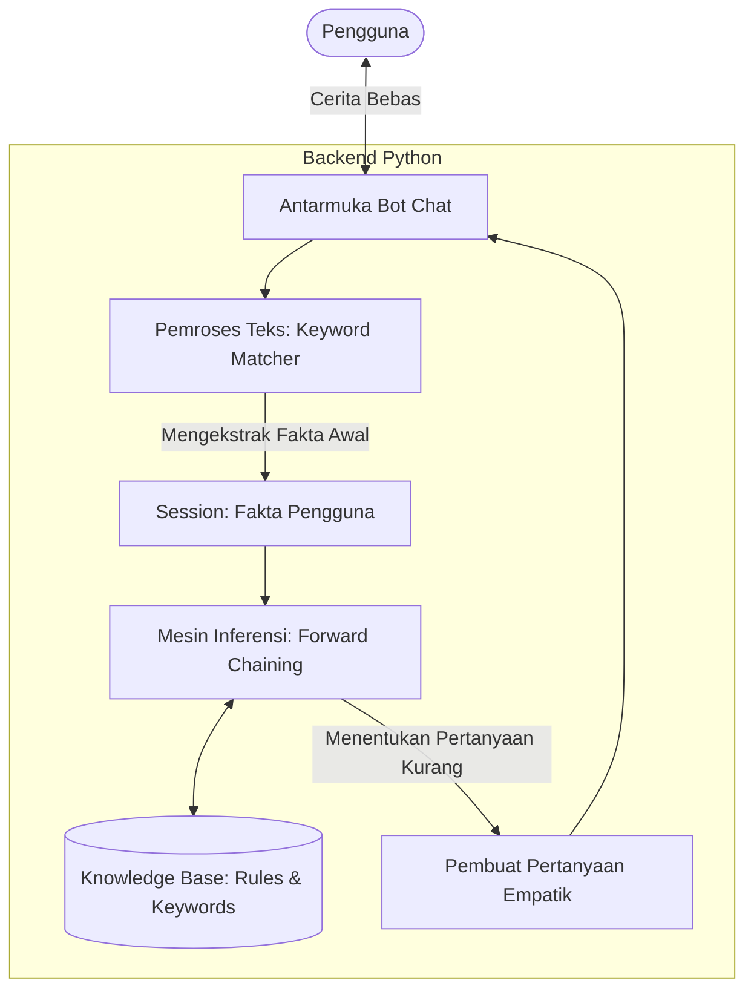

# Rancangan Sistem Pakar Chatbot Psikologi: Pendekatan "Teman Curhat"

Dokumen ini berisi rancangan arsitektur chatbot sistem pakar yang berfokus pada pendekatan humanis (teman curhat). Sistem ini menggabungkan **Pengecekan Kata Kunci (Keyword Extraction)** untuk memahami cerita awal pengguna, dengan **Mesin Inferensi (Forward Chaining)** untuk menggali informasi lebih dalam dan memberikan solusi.

---

## 1. Konsep & Pendekatan (Venting Buddy / Teman Curhat)
*   **Persona Bot**: Hangat, empatik, tidak kaku (seperti teman sendiri).
*   **Alur Fleksibel**: Tidak langsung memberondong pengguna dengan kuisioner. Pengguna dibebaskan untuk bercerita (curhat) terlebih dahulu.
*   **Deteksi Pintar**: Sistem akan "membaca" cerita pengguna dan secara otomatis menandai gejala yang terdeteksi tanpa harus ditanyakan.
*   **Pertanyaan Dinamis**: Bot hanya akan menanyakan gejala yang **belum** diceritakan tetapi dibutuhkan oleh mesin inferensi untuk mengambil kesimpulan.

## 2. Alur Percakapan (Conversational Flow)

1.  **Fase 1: Greeting & Open-Ended Question**
    *   **Bot**: "Hai! Aku teman curhatmu di sini. Gimana harimu? Kalau ada yang lagi berat atau mengganjal di pikiran, ceritain aja pelan-pelan ya..."
2.  **Fase 2: User Bercerita (Curhat)**
    *   **User**: "Iya nih, akhir-akhir ini aku ngerasa hampa banget, kerjaan numpuk tapi gak ada motivasi, terus tiap malem susah tidur."
3.  **Fase 3: Keyword Extraction (Di Balik Layar)**
    *   Sistem memindai teks:
        *   "hampa" -> Menyimpulkan Fakta **G2 (Sedih/Hampa) = True**
        *   "gak ada motivasi" -> Menyimpulkan Fakta **G8 (Penurunan motivasi) = True**
        *   "susah tidur" -> Menyimpulkan Fakta **G4 (Gangguan tidur) = True**
4.  **Fase 4: Pertanyaan Tertarget (Berdasarkan Rules)**
    *   Mesin Inferensi (Forward Chaining) melihat fakta yang sudah ada. 
    *   Sistem menyadari bahwa untuk mencapai kesimpulan (misal: MDD), ia masih butuh tahu apakah pengguna sering marah (G1) atau merasa sakit fisik (G5).
    *   **Bot**: "Pasti berat banget ya ngelewatin itu semua. Aku paham kok rasanya capek fisik dan mental. Btw, selain susah tidur, akhir-akhir ini kamu jadi gampang emosi atau gampang tersinggung gak sih?" *(Menanyakan G1)*
5.  **Fase 5: Solusi & Diagnosa Halus**
    *   Setelah fakta dirasa cukup oleh mesin inferensi.
    *   **Bot**: "Makasih ya udah mau cerita jujur sama aku. Dari apa yang kamu ceritain, sepertinya kamu lagi ada di fase Burnout dan ada kecenderungan depresi (MDD). Saran aku, coba mulai dari benerin pola tidur pelan-pelan, dan kalau rasanya udah gak ketahan, jangan ragu buat ngobrol sama profesional ya. Kamu gak sendirian kok."

## 3. Arsitektur Sistem Hybrid



## 4. Struktur Data (Knowledge Base & Keywords)

Berbeda dengan sistem pakar biasa, setiap fakta (gejala) harus dipetakan dengan sekumpulan **kata kunci (keywords)** atau sinonim.

```python
knowledge_base = {
    'G1': {
        'nama': 'Mudah marah/tersinggung',
        'keywords': ['marah', 'emosi', 'tersinggung', 'sensitif', 'kesel', 'baper', 'gampang meledak'],
        'pertanyaan': 'Akhir-akhir ini, kamu ngerasa jadi lebih gampang emosi atau tersinggung gak dari biasanya?'
    },
    'G2': {
        'nama': 'Perasaan sedih/hampa',
        'keywords': ['sedih', 'hampa', 'kosong', 'nangis', 'murung', 'galau', 'depresi', 'gak berguna'],
        'pertanyaan': 'Apa kamu belakangan ini sering ngerasa sedih yang dalem banget, atau ngerasa kosong gitu aja?'
    },
    'G3': {
        'nama': 'Kesulitan fokus',
        'keywords': ['fokus', 'konsentrasi', 'lupa', 'blank', 'gak nyambung'],
        'pertanyaan': 'Kerjaan atau tugasmu keganggu gak sih? Maksudku, kamu jadi susah fokus atau gampang lupa gitu?'
    },
    'G4': {
        'nama': 'Gangguan tidur',
        'keywords': ['tidur', 'insomnia', 'begadang', 'gak bisa tidur', 'kebablasan tidur', 'bangun tengah malem'],
        'pertanyaan': 'Pola tidurmu gimana belakangan ini? Sering susah tidur atau malah bawaannya pengen tidur terus?'
    }
    # Dan seterusnya...
}
```

## 5. Algoritma (Flow Logika Python)

1. **Inisiasi**: Bot menyapa.
2. **Mendengar**: Bot membaca teks panjang pengguna.
3. **Pencocokan**: Teks diubah ke huruf kecil (*lowercase*), lalu dicocokkan dengan `keywords`. Jika cocok, fakta = `True`.
4. **Analisis Kekurangan (Rule Evaluation)**:
   * Loop melalui semua *Rules* (IF-THEN).
   * Cari Rule yang sudah hampir terpenuhi (misal Rule butuh G1 dan G2, tapi kita baru punya G2).
   * Ambil G1 sebagai "target pertanyaan selanjutnya".
5. **Bertanya**: Bot mengajukan `pertanyaan` dari G1 menggunakan gaya bahasa santai.
6. **Iterasi**: Ulangi sampai ada konklusi atau semua gejala penting terjawab.
7. **Solusi**: Keluarkan rekomendasi.
